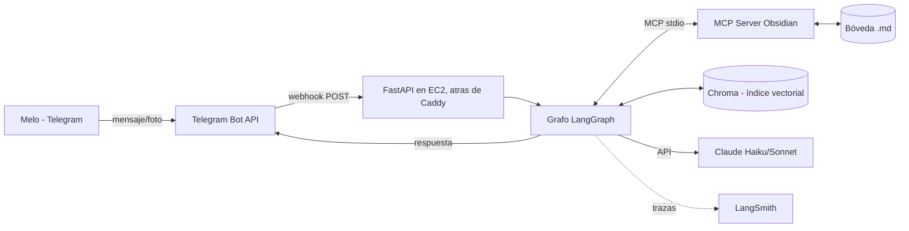
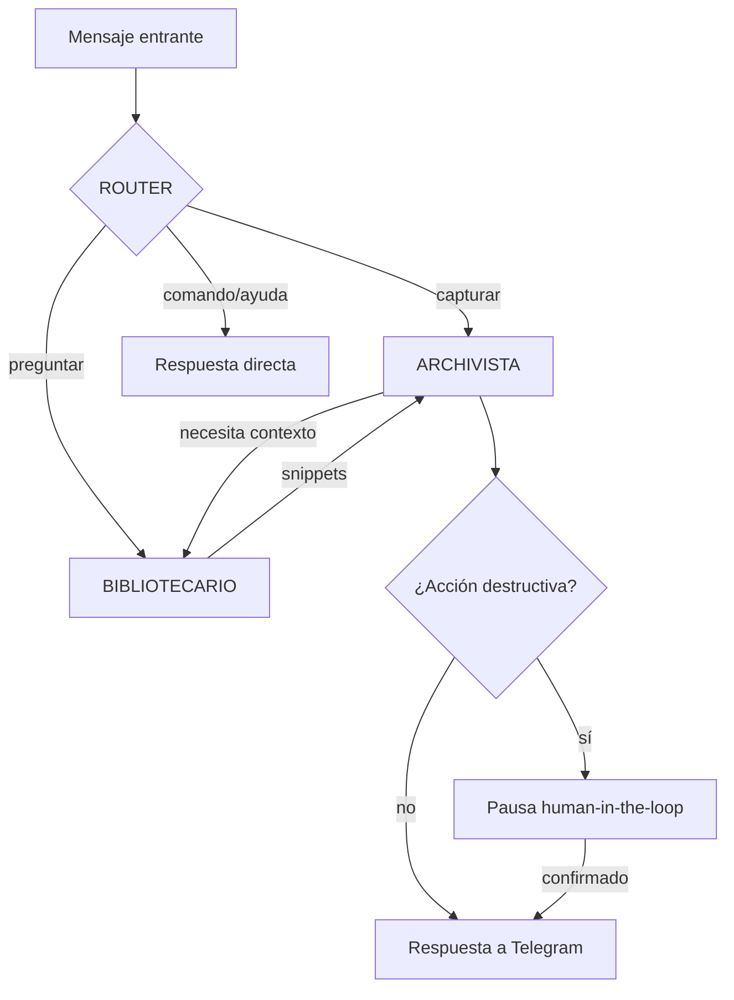

# SEGUNDO CEREBRO — Documento fundacional de diseño y plan de desarrollo

> **Propósito de este documento**: es la fuente de verdad inicial del proyecto. Todas las decisiones acá ya están tomadas (con su justificación). Si algo cambia durante el desarrollo, se actualiza este archivo primero. Está pensado para vivir en la raíz del repo y servir como contexto inicial para cualquier sesión de trabajo (humana o con IA).

> **Estado**: diseño cerrado, desarrollo no iniciado. Fecha: septiembre 2026.

---

## PARTE 1 — DECISIONES CERRADAS (stack definitivo)

| Capa | Decisión | Alternativa descartada | Por qué |
|---|---|---|---|
| Orquestación de agentes | **LangGraph** | AutoGen, n8n, Workato | Es el gap de currícula identificado; framework Python real, no builder visual |
| Modelo de razonamiento | **Claude** — Haiku para ruteo, Sonnet para razonamiento/escritura | Un solo modelo para todo | El router corre en cada mensaje: usar el modelo caro ahí es tirar plata. Ver §4.2 |
| Mensajería | **Telegram Bot API** (webhook) | WhatsApp | Meta cobra mensajes de servicio desde oct-2026; Telegram es gratis y sin plantillas |
| Framework web | **FastAPI** | Handler de Lambda pelado, Flask | Tipado, docs automáticas, testeable, currícula fuerte |
| Deploy inicial | **AWS EC2** (una instancia, Docker, IP elástica fija) | Fargate + ALB, Lambda + Mangum | Segunda revisión en Fase 6: Fargate resolvía el costo del NAT Gateway, pero necesita un ALB (~$16-25/mes) para tener una URL estable, porque la IP pública de una tarea cambia en cada reinicio. Una sola instancia EC2 con IP elástica nativa resuelve lo mismo sin ALB, y de paso no necesita EFS (una sola máquina no necesita disco compartido en red — el EBS de la propia instancia alcanza) |
| Conexión agente↔bóveda | **Servidor MCP propio** (Python SDK oficial) | Código Python a medida dentro del grafo | MCP es el estándar 2026; escribir un server propio es pieza de portfolio |
| Conexión agente↔Telegram | **Directa (webhook + httpx)**, NO vía MCP | MCP server para Telegram | Telegram es la puerta de entrada, no una tool del agente. Meterle MCP es complejidad sin ganancia. El agente responde por el mismo canal que recibió |
| Almacenamiento de notas | **Bóveda Obsidian** (markdown plano) en servidor AWS, headless | Base de datos | Ya decidido en sesiones anteriores; capa visual gratis |
| Búsqueda semántica | **RAG: Chroma embebido + embeddings de Voyage AI** | Pinecone, Weaviate, FAISS | Chroma es librería (costo $0, persiste a disco, API simple). Voyage es el proveedor de embeddings recomendado por Anthropic, tier gratuito generoso. FAISS descartado por no traer persistencia+metadata out of the box |
| Memoria de corto plazo | **Checkpointer de LangGraph sobre SQLite** | Redis | Ya decidido: Redis prescindible. SQLite local del server cumple el rol sin costo. Migrable a Redis/Postgres cambiando una línea |
| Estado compartido | **Estado tipado de LangGraph (pizarra)** con Pydantic | dicts sueltos | Validación y autocompletado; error de esquema explota en desarrollo, no en producción |
| Observabilidad | **LangSmith tier gratuito** (5.000 trazas/mes) | Langfuse self-hosted | Dos líneas de config, cero infra propia. A ~360 llamadas/mes sobra margen |
| CI/CD | **GitHub Actions**: ruff + mypy + pytest + deploy en push a main | Deploy manual | Es el gap de "experiencia de producción" |
| Gestión de dependencias | **uv** + `pyproject.toml` | pip + requirements.txt | Estándar moderno 2026, rápido, lockfile reproducible |
| Python | **3.12** | 3.13 | Compatibilidad garantizada con todo el stack |
| HTTPS del webhook | **Caddy + sslip.io** | ALB + ACM, dominio propio | Telegram exige HTTPS. sslip.io da un dominio automático a partir de la IP elástica (ej. 52-1-2-3.sslip.io), y Caddy consigue y renueva el certificado de Let's Encrypt solo, sin tocar código de la app. Cero costo, cero dominio que comprar |
| Imágenes | **Sí, desde fase 7**: fotos por Telegram → visión de Claude → nota en la bóveda | Ignorar imágenes | Caso de uso real de un segundo cerebro (pizarras, tickets, apuntes en papel) |
| Audios | **Sí, desde fase 7.5**: audios por Telegram → transcripción → el grafo de siempre | Ignorar audios; Claude directo | La API de Claude **no acepta audio** (lo ignora y lo descarta), así que hace falta un paso previo de transcripción. Una vez transcripto es texto común: el Router y el Archivista ya existentes lo manejan sin cambios |
| Transcripción de audio | **Groq (Whisper)** | OpenAI Whisper, Deepgram, self-host | Tier gratuito de 2.000 audios/día sin tarjeta — a ~3 mensajes/día el costo es $0. Self-host descartado: el `t3.micro` tiene 1 GB de RAM y sin GPU |

---

## PARTE 2 — ARQUITECTURA DEL SISTEMA

### 2.1 Vista general



Todo (bóveda, Chroma, SQLite del checkpointer) vive en el mismo servidor/volumen AWS. La compu y el celular de Melo sincronizan la bóveda cuando se conectan.

**Sincronización de la bóveda a los dispositivos — decisión (Fase 7.6): Syncthing.**
Se evaluaron cuatro opciones (Obsidian headless, Obsidian Sync pago,
Self-hosted LiveSync + CouchDB, Syncthing). Las tres primeras necesitan
*algún* Obsidian corriendo en el server para vigilar el filesystem; el bot
en cambio escribe archivos markdown planos. Syncthing sincroniza archivos
directamente, así que encaja sin sumar un Obsidian headless ni una base de
datos. Corre como un contenedor más en el `docker-compose` de la
instancia, montando `./data/boveda`. **No se abre ningún puerto nuevo en
el Security Group** (solo 80/443): la conexión con la PC de Melo se
establece igual, P2P y directa, por perforación de NAT sobre UDP/QUIC
(Syncthing en ambos extremos marca hacia afuera a la vez, y el firewall
stateful de AWS deja pasar el tráfico de retorno). Los relays públicos de
Syncthing quedan como fallback si esa conexión directa no se logra. En
cualquier caso el tráfico va cifrado punta a punta — ni el relay ni nadie
en el medio ve el contenido. Gratis, sin cuenta de terceros.
*(Resuelto en Fase 12)*: antes, una nota que Melo creara/editara en su
Obsidian local no entraba al índice de Chroma (el Archivista solo indexa
lo que crea el bot). Ahora un loop en `app/main.py` corre
`rag.indexar.sincronizar_indice()` cada ~5 min: compara el mtime de cada
`.md` de la bóveda contra un manifiesto y reindexa lo que cambió, borra
del índice lo que ya no existe. También cubre las listas de tareas. Se
excluye `90-sistema/`, `.obsidian/` y demás. Comando `/reindexar` para
forzarlo.

### 2.2 Los agentes (6 nodos de decisión: Router + Archivista + Bibliotecario + Recordatorio + Tareas + directo)

Principio de diseño: **la menor cantidad de agentes que cubra los casos de uso**. Cada agente extra es más tokens, más latencia y más superficie de error. Se arranca con estos y no se agregan más hasta que la evaluación (§6) demuestre que hace falta.



**1. ROUTER (nodo con Haiku)**
- Único trabajo: clasificar la intención del mensaje en una de estas clases: `capturar` (guardar algo), `consultar` (preguntar algo a la bóveda), `tarea` (crear/completar un pendiente), `recordatorio` (pedir un aviso en un momento futuro), `imagen` (llegó foto), `comando` (ayuda, estado, config), `ambiguo`.
- Sin herramientas. Devuelve JSON estructurado (clase + confianza). Si `ambiguo`, repregunta al usuario en vez de adivinar.
- Es el nodo que corre en el 100% de los mensajes → por eso Haiku.

**2. ARCHIVISTA (agente con Sonnet)**
- Maneja las **capturas** (`capturar`) y las **imágenes** (`imagen`): decide título y tags, y escribe la nota en `00-inbox/` (las de imagen en `30-imagenes/`). Las `tarea` ya no pasan por acá — las agarra el nodo Tareas.
- Herramientas (todas vía MCP Obsidian): `crear_nota`, `agregar_a_nota`, `listar_carpeta`, `leer_nota`.
- **NO tiene** herramienta de borrar ni de sobrescribir completo. Regla de la sesión anterior: la restricción es de código, no de prompt.

**3. BIBLIOTECARIO (agente con Sonnet, el "mensajero")**
- Responde consultas: busca en Chroma (semántico) y/o lee notas puntuales, y devuelve **solo los fragmentos relevantes**, nunca archivos enteros al estado compartido.
- Herramientas: `buscar_semantico` (Chroma), `leer_nota`, `buscar_por_titulo` (MCP).
- Es de solo lectura por diseño: no tiene ninguna herramienta de escritura.

**4. RECORDATORIO (agente con Sonnet) — Fase 10, recurrentes en Fase 13**
- Interpreta *"recordame X el martes 10am"*: saca el texto y resuelve el "cuándo" a una fecha/hora concreta (relativa a la hora actual del usuario, `TZ_USUARIO`). Detecta si es **recurrente** (*"todos los lunes"* → `semanal`, *"todos los días"* → `diario`, *"el 1 de cada mes"* → `mensual`).
- Da de alta el recordatorio en `90-sistema/recordatorios.jsonl` (mismo criterio que `correcciones.jsonl`: en la bóveda, sin base de datos aparte, visible desde Obsidian).
- Si el mensaje no trae un cuándo, repregunta. Si la hora ya pasó, la rechaza.
- **El disparo NO lo hace este nodo**: el loop proactivo de `app/main.py` (cada minuto) manda el aviso por Telegram. Los de una vez se marcan `enviado`; los recurrentes se **reprograman** a la próxima ocurrencia. Es el primer comportamiento *proactivo* del bot (antes solo respondía). Se eligió un loop en el mismo proceso en vez de EventBridge/Lambda: todo vive en un contenedor y no hace falta más.
- El mismo loop manda el **briefing matutino** (Fase 13): una vez por día a partir de `HORA_BRIEFING` (local, default 8), con los recordatorios que vencen hoy + las listas de tareas abiertas. Si no hay nada, no manda. Un archivo `90-sistema/ultimo_briefing.txt` evita repetirlo.
- Comandos operativos asociados (en el webhook, no en el grafo): `/recordatorios` lista los pendientes (con su recurrencia), `/cancelar <id>` cancela uno.

**5. TAREAS (agente con Sonnet) — Fase 11**
- Maneja la intención `tarea` como **listas con checkboxes**, no una nota por tarea. *"comprá pan la próxima vez que vayas al súper"* → `- [ ] pan` en `20-tareas/compras.md`.
- Del mensaje saca: la operación (`agregar` / `completar` / `mostrar`), a qué lista, y los items. El modelo elige la lista si el usuario no la nombra (`compras` si suena a súper, `pendientes` si no).
- Herramientas (código directo sobre la bóveda, no MCP): `agregar_a_lista`, `marcar_en_lista`, `leer_lista`. Marcar hecho es `- [x]` (queda el historial). No borra líneas.
- Comando asociado (en el webhook): `/lista` nombra las listas, `/lista <nombre>` la muestra.

**6. Nodo de respuesta directa (sin LLM o con Haiku)**
- Comandos fijos (`/ayuda`, `/estado`, `/costos`) se responden con texto plantillado. Cero tokens de Sonnet.

**DIGESTOR (Fase 14, agente sin nodo)** — no responde a mensajes: lo dispara el loop proactivo una vez por semana (día/hora configurables, default lunes 9). Recorre la bóveda: sintetiza con Sonnet lo capturado en 7 días, lista lo que quedó viejo en `00-inbox/`, y el estado de las listas. Deja el repaso como nota en `90-sistema/` y manda la versión corta por Telegram. `/digest` lo corre a mano. Vive en `src/digestor/`, no en `grafo/nodos/`, porque no es parte del grafo. Se eligió el loop en proceso (no EventBridge) por consistencia con recordatorios y briefing.

### 2.3 Estado compartido (la "pizarra")

Esquema Pydantic único que viaja por el grafo:

```python
class Estado(BaseModel):
    mensajes: list[Mensaje]          # historial del turno (no de toda la vida)
    intencion: Intencion | None      # lo que decidió el Router
    snippets: list[Snippet]          # lo que trajo el Bibliotecario
    acciones_propuestas: list[Accion]# lo que el Archivista quiere hacer
    requiere_confirmacion: bool      # gatillo human-in-the-loop
    presupuesto: Presupuesto         # tokens/pasos consumidos vs. límite
    respuesta_final: str | None
```

### 2.4 Control, seguridad y presupuesto (reglas duras)

1. **Herramientas por agente restringidas en código** (tabla de §2.2). El prompt describe el rol; el código impone el límite.
2. **Human-in-the-loop**: cualquier acción marcada destructiva/riesgosa (hoy: ninguna existe porque el Archivista no puede borrar; queda el mecanismo listo para cuando se sumen acciones nuevas) usa `interrupt()` de LangGraph → el sistema manda a Telegram "¿Confirmás X? (sí/no)" y el grafo queda pausado en el checkpointer hasta la respuesta.
3. **Freno por presupuesto** (idea de la sesión anterior, ahora concreta): cada corrida arranca con límite de **15 pasos de grafo y 50.000 tokens acumulados**. Un nodo contador se ejecuta antes de cada agente; si se superó el límite, el grafo corta y devuelve: qué se logró, qué faltó, y dónde se trabó. Mismo patrón que la pausa por riesgo, gatillado por gasto.
4. **Un solo usuario autorizado**: el webhook valida el `chat_id` de Melo y el secret token de Telegram. Cualquier otro remitente se ignora (ni se loguea el contenido).

### 2.5 La bóveda (estructura inicial)

```
boveda/
  00-inbox/        ← todo lo capturado cae acá primero
  10-notas/        ← notas permanentes (el Archivista promueve desde inbox)
  20-tareas/       ← una nota por lista, con checkboxes markdown (Fase 11).
                     Ej: compras.md, farmacia.md, viaje.md. El nodo Tareas
                     agrega "- [ ] item" y marca "- [x]" al completar.
  30-imagenes/     ← foto original + nota .md con la descripción/transcripción
  90-sistema/      ← logs legibles (correcciones.jsonl de /corregir,
                     recordatorios.jsonl), digest semanal (fase 9)
```

Convención de frontmatter en cada nota: `fecha`, `origen: telegram`, `tags`, `estado: inbox|permanente`. El Archivista la respeta siempre; el índice de Chroma la usa como metadata filtrable.

### 2.6 Manejo de imágenes (fase 7)

Flujo: foto llega por Telegram → FastAPI la descarga (API de archivos de Telegram) → se guarda en `30-imagenes/` → el Router la clasifica como `imagen` → el Archivista la manda a Claude con visión (Sonnet) pidiendo: transcripción de texto visible + descripción de una línea + tags sugeridos → crea la nota `.md` acompañante con link a la imagen → la nota entra al índice RAG como cualquier otra (la imagen en sí no se indexa, su descripción sí).

### 2.7 Interfaz

- **Única interfaz de usuario: Telegram.** Sin frontend web propio (decisión: no aporta al objetivo y suma mantenimiento).
- **Capa visual de las notas: Obsidian** en la compu/celular de Melo (sincronizado con la bóveda del server vía Syncthing, ver §2.1). Obsidian *es* la UI de lectura rica; el bot es la UI de captura y consulta rápida.
- **Interfaz de operación/debug: LangSmith** (trazas) + `/estado` y `/costos` por Telegram.

---

## PARTE 3 — ESTRUCTURA DEL REPO

```
segundo-cerebro/
  DISEÑO.md                  ← este documento
  pyproject.toml             ← uv, deps, config de ruff/mypy/pytest
  src/
    app/main.py              ← FastAPI: webhook, validación, healthcheck
    grafo/
      estado.py              ← modelos Pydantic (§2.3)
      grafo.py               ← construcción del StateGraph
      nodos/                 ← router.py, archivista.py, bibliotecario.py, directo.py, presupuesto.py
      prompts/               ← un .md por agente (equivalente a "skills", editable sin tocar código)
    mcp_obsidian/servidor.py ← MCP server propio de la bóveda
    rag/indexar.py           ← chunking + embeddings + Chroma (corre como script y como tool)
    telegram/cliente.py      ← enviar mensajes, bajar archivos
  tests/
    unit/                    ← nodos con LLM mockeado, MCP server, parsers
    eval/mensajes.jsonl      ← los 20-30 mensajes etiquetados (§6)
  .github/workflows/ci.yml
  infra/                     ← template de CloudFormation (EC2, IP elastica, ECR,
                               IAM), desplegado con `sam deploy --guided` -- ya no
                               hay recursos "serverless" de SAM en si (eso era para
                               Lambda), pero el CLI sigue sirviendo como forma simple
                               de deployar CloudFormation paso a paso
    docker-compose.yml        ← app + Caddy corriendo juntos en la instancia
    Caddyfile                 ← config de Caddy: dominio sslip.io + proxy a la app
  Dockerfile                 ← imagen de la app
```

---

## PARTE 4 — DECISIONES FINAS

### 4.1 Por qué el MCP server va por stdio y no HTTP
El grafo y el server de Obsidian corren en el mismo proceso/máquina. stdio es el transporte estándar para ese caso: sin puertos, sin auth extra, sin red. Si algún día el server se separa a otra máquina, el SDK permite cambiar a Streamable HTTP sin reescribir las tools.

### 4.2 Modelos concretos
- Router y respuestas plantilladas: `claude-haiku-4-5`.
- Archivista, Bibliotecario, visión: `claude-sonnet-4-6` (o el Sonnet vigente al momento de construir — verificar en la doc de Anthropic, no asumir).
- Los nombres de modelo van en config/env, nunca hardcodeados en los nodos.

### 4.3 Embeddings y chunking
- Voyage AI (`voyage-3.5-lite` o el equivalente vigente — verificar al construir), vía API.
- Chunking: por secciones de markdown (headers) con máximo ~500 tokens por chunk; cada chunk guarda `ruta`, `titulo`, `tags` como metadata en Chroma.
- Reindexado: (a) al escribir una nota, el Archivista dispara la indexación de esa nota sola; (b) un loop en `app/main.py` (Fase 12) corre `sincronizar_indice()` cada ~5 min y empareja el índice con la bóveda por mtime (cubre lo que Melo edita en Obsidian y las listas de tareas), con un manifiesto en `RUTA_INDICE_CHROMA/reindex_manifest.json`; (c) `reindexar_todo()` como script manual, para cuando cambia el modelo de embeddings o el chunking.

### 4.4 Qué NO entra (repetido a propósito, para resistir la tentación)
PyTorch, TensorFlow, AutoGen, n8n, Workato, UiPath, Redis, Pinecone, frontend web propio, fine-tuning. Justificación completa en el plan tecnológico anterior. Regla: nada de esto entra sin que la evaluación (§6) demuestre una necesidad que el stack actual no cubre.

**Excepción registrada (fase 7.5): Groq**, como proveedor de transcripción. No entra por gusto sino porque la API de Claude no acepta audio, así que la funcionalidad es imposible sin *algún* servicio de transcripción. Se eligió el más barato a este volumen ($0) y se anotó el costo real en privacidad (§Parte 7, punto 3). Este es el estándar que debe cumplir cualquier agregado futuro: una necesidad que el stack actual no puede cubrir, no una preferencia.

---

## PARTE 5 — PLAN DE DESARROLLO PASO A PASO

Cada fase termina con un **criterio de aceptación verificable**. No se avanza a la siguiente sin cumplirlo. Estimaciones pensadas para ritmo part-time sin experiencia previa en LangGraph ni AWS (dato de la sesión anterior).

**FASE 0 — Fundaciones (1 sesión)**
Repo en GitHub, `uv init`, Python 3.12, ruff+mypy+pytest configurados, este documento en la raíz, CI que corre lint+tests (aunque el test sea `assert True`).
✅ *Push a main → CI verde.*

**FASE 1 — Hola mundo LangGraph (1-2 sesiones)**
Grafo mínimo de 2 nodos con estado Pydantic, corriendo por CLI local, llamando a Claude una vez. LangSmith conectado desde acá (2 env vars).
✅ *`uv run python -m grafo` responde, y la traza aparece en LangSmith.*

**FASE 2 — Router + esqueleto de agentes, todo local por CLI (2-3 sesiones)**
Los 4 nodos de §2.2 con sus prompts en `prompts/`. El Archivista y Bibliotecario todavía usan herramientas *falsas* (escriben en una carpeta local cualquiera). Nodo de presupuesto funcionando (cortar a los N pasos y devolver resumen parcial).
✅ *Por CLI: "guardá que la idea X me gustó" crea un archivo; "¿qué guardé de X?" lo encuentra; un mensaje diseñado para loopear se corta por presupuesto con resumen.*

**FASE 3 — MCP server de Obsidian (2-3 sesiones)**
`mcp_obsidian/servidor.py` con el SDK oficial de Python: tools `crear_nota`, `agregar_a_nota`, `leer_nota`, `listar_carpeta`, `buscar_por_titulo`. Respeta la estructura y el frontmatter de §2.5. Los agentes pasan a usar estas tools reales (vía stdio). Tests del server sin LLM (llamadas MCP directas).
✅ *El flujo de fase 2 ahora escribe/lee una bóveda Obsidian real y las notas se ven bien abiertas en Obsidian.*

**FASE 4 — RAG (2 sesiones)**
`rag/indexar.py`: chunking + Voyage + Chroma persistente. Tool `buscar_semantico` conectada al Bibliotecario. Indexación incremental al escribir.
✅ *Una pregunta cuya respuesta está en una nota vieja con otras palabras ("¿qué dije sobre plata?" encontrando una nota que habla de "presupuesto") se responde bien.*

**FASE 5 — FastAPI + Telegram real, corriendo local (2 sesiones)**
`app/main.py` con el endpoint webhook, validación de secret y chat_id, `telegram/cliente.py`. Túnel local (ngrok o similar) para probar con el bot real desde el celular. Human-in-the-loop por Telegram funcionando (aunque hoy no haya acciones destructivas, se prueba el mecanismo con una acción de mentira).
✅ *Mensaje desde el celular de Melo → respuesta del bot; mensaje desde otro chat_id → silencio.*

**FASE 6 — AWS + CI/CD completo (3-4 sesiones, la fase con más fricción esperada)**
Cuenta AWS con presupuesto/alarma de facturación configurada ANTES que nada (✅ hecho: Free Plan + MFA en root + alarma de $5/mes). IAM Identity Center para credenciales locales, sin access keys de larga duración (✅ hecho). Dockerfile de la app (✅ hecho, probado local con `docker build`/`docker run`). Repositorio ECR para la imagen. Una instancia EC2 (Amazon Linux, Docker) con IP elástica fija, acceso por SSM (sin SSH). Caddy corriendo al lado de la app (docker-compose) haciendo de proxy HTTPS automático via sslip.io. Bóveda+Chroma+SQLite en el disco de la propia instancia (EBS, no hace falta EFS con una sola máquina). Secretos en AWS Systems Manager Parameter Store (SecureString), nunca en el template ni en el repo. Webhook de Telegram apuntado a la URL real. GitHub Actions deployando en push a main (build de la imagen, push a ECR, SSM Run Command que reautentica el docker de la instancia contra ECR —su token vence a las 12 h— y recién después hace `docker-compose pull` + `up -d`).
✅ *El bot responde con la compu de Melo apagada, y un push a main llega solo a producción.*

**FASE 7 — Imágenes (1-2 sesiones)** — *terminada y verificada en producción*
Flujo completo de §2.6. El webhook baja la foto y la guarda en `30-imagenes/`; al grafo le llega solo la **ruta**, nunca los bytes (el estado se serializa al checkpointer en cada paso, y meterle imágenes en base64 lo haría crecer sin control). El Router hace cortocircuito: si hay foto, la intención es `imagen` sin consultar a Haiku — lo dice la estructura del mensaje de Telegram, no hace falta un modelo para adivinarlo. El webhook acepta la imagen tanto comprimida (campo `photo`) como sin comprimir / "enviada como archivo" (campo `document` con `mime_type` `image/*`).
✅ *Foto de una pizarra/apunte por Telegram → nota con transcripción en `30-imagenes/`, encontrable después por búsqueda semántica.*

**FASE 7.5 — Audios (1 sesión)** — *terminada y verificada en producción*
Audio por Telegram → descarga (mismo código que las fotos) → transcripción con Groq (`whisper-large-v3-turbo`, por HTTP directo al endpoint compatible con OpenAI, forzando `language=es`) → el texto entra al grafo como si se hubiera tipeado. **No hace falta ningún agente nuevo**: el Router ya distingue `capturar` de `tarea`, y el Archivista ya sabe guardar. Telegram manda las notas de voz en OGG/Opus, que Whisper acepta sin transcodificar. Cubre el campo `voice` (botón de micrófono) y `audio` (archivo de audio).
✅ *Audio hablado por Telegram → nota en la bóveda con lo que se dijo, ruteada correctamente según sea idea o tarea.*

**FASE 7.6 — Sincronización de la bóveda (1 sesión)** — *terminada y verificada*
Contenedor `syncthing` en el `docker-compose` de la instancia, montando `./data/boveda`. Sincroniza P2P (directo, ver §2.1) contra el Obsidian local de Melo en `D:\Second Brain`, en modo *send & receive* (bóveda única unificada). Se sumó 1 GB de swap a la instancia primero (`t3.micro` = 1 GB RAM, sin swap, y Syncthing suma ~25 MB). Detalle y hueco conocido (índice RAG) en §2.1. La configuración del folder/device es un paso manual único, como los secretos (el `UserData` solo corre al crear la máquina). En la PC de Melo corre el Syncthing oficial v2 (SyncTrayzor quedó descartado: no arranca con Syncthing v2).
✅ *El bot escribe una nota → aparece en el Obsidian de la PC de Melo en segundos, y al revés.*

**FASE 8 (opcional, para portfolio)**
Idea a definir cuando se llegue ahí -- por ejemplo, un dominio propio en vez de depender de sslip.io, o migrar a Fargate/ECS mas adelante si el proyecto crece a necesitar mas de una instancia.

**FASE 9 — Evaluación + Digestor (2-3 sesiones)** — *harness del Router y `/corregir` hechos; falta el set real y el Digestor*
Set en `tests/eval/mensajes.jsonl`, runner `tests/eval/evaluar.py`, baseline en `tests/eval/baseline.json`, workflow `eval.yml`, comando `/corregir` + `tests/eval/incorporar.py` para alimentar el set (§6). El set y el baseline se movieron al agregar `recordatorio` (§Fase 10): 28 casos, baseline ~93% (una corrida dio 100% y otra 93% por un caso genuinamente ambiguo — *"recordame comprar el regalo para el cumple de mamá"*, sin hora). Falta: la métrica del Bibliotecario (top-3) y el agente Digestor semanal vía EventBridge.
✅ *Cambiar un prompt y saber en un comando si mejoró o empeoró.*

**FASE 10 — Recordatorios / proactividad (1 sesión)** — *hecha*
Primer paso fuera del patrón puramente reactivo. Intención `recordatorio` en el Router → nodo que resuelve el "cuándo" (relativo a `TZ_USUARIO`) y da de alta el registro en `90-sistema/recordatorios.jsonl`. Un loop en `app/main.py` (cada 60s, mismo proceso, sin EventBridge) revisa vencimientos y manda el aviso por Telegram. `/recordatorios` y `/cancelar <id>` para administrarlos. El eval confirmó que las otras 6 intenciones no se rompieron. Detalle en §2.2.
✅ *"recordame llamar al banco el martes 10am" → el martes a las 10 llega un mensaje del bot.*

**FASE 11 — Listas de tareas (1 sesión)** — *hecha*
La intención `tarea` deja el modelo "una nota por tarea" y pasa a **listas con checkboxes** (§2.2, nodo Tareas). Sin tocar el Router (la intención ya existía) → sin re-correr el eval. El Archivista quedó solo para capturas e imágenes. Falta natural-language para *mostrar* una lista (hoy es `/lista <nombre>`); *agregar* y *marcar hecho* sí funcionan hablando normal.
✅ *"compra pan y leche la próxima vez que vayas al súper" → aparecen en `20-tareas/compras.md`; "ya compré el pan" lo tacha.*

**FASE 12 — Índice al día con la bóveda (1 sesión)** — *hecha*
Cierra el hueco de §2.1: lo que Melo edita en Obsidian y las listas de tareas ahora sí son buscables. Loop en `app/main.py` que corre `rag.indexar.sincronizar_indice()` cada ~5 min (compara mtime contra un manifiesto, reindexa lo cambiado, borra lo que ya no existe, de a 3 notas por vuelta por el rate limit de Voyage). Comando `/reindexar` para forzarlo. Sin tocar el Router → sin eval. Ver §4.3.
✅ *Escribo una nota en Obsidian → a los pocos minutos el Bibliotecario la encuentra por búsqueda semántica.*

**FASE 13 — Recordatorios recurrentes + briefing matutino (1 sesión)** — *hecha*
Aprovecha la infra de la Fase 10. El nodo Recordatorio ahora saca también la recurrencia (`diario`/`semanal`/`mensual`); al dispararse, un recurrente se reprograma en vez de marcarse `enviado`. El loop proactivo suma el briefing matutino (§2.2). Sin tocar el Router → sin eval.
✅ *"todos los lunes recordame mandar la factura" → llega cada lunes; y cada mañana un resumen de lo que vence hoy + listas abiertas.*

**FASE 14 — Digestor semanal (1 sesión)** — *hecha*
El agente diferido de §2.2, por fin. `src/digestor/`, disparado por el loop proactivo una vez por semana + comando `/digest`. Sin nodo de grafo (no responde a mensajes). Sin tocar el Router → sin eval. De paso, limpieza del repo: se sacaron de git `chroma_index/` y `grafo_checkpoints.sqlite` (artefactos de runtime), y `src/grafo/boveda_local.py` (herramientas falsas de la Fase 2, muertas desde la Fase 3). README reescrito en inglés.
✅ *Cada lunes 9am llega un repaso de lo que capturaste la semana + inbox viejo + listas, y queda como nota en `90-sistema/`.*

---

## PARTE 6 — EVALUACIÓN (cómo sabemos que funciona)

- **Set de prueba**: 20-30 mensajes etiquetados a mano con la intención correcta y (para capturas) la carpeta/tags esperados. Formato JSONL, en `tests/eval/mensajes.jsonl`. Cada caso lleva un campo `fuente` (`real` | `sintetico`). Arranca chico y mayormente sintético; crece con uso real vía `/corregir`.
- **Métrica principal**: tasa de acierto del Router (es el nodo del que depende todo lo demás). La corre `tests/eval/evaluar.py` contra el Router real (pega a la API de Claude).
- **Baseline y umbral**: `tests/eval/baseline.json` guarda la última tasa aceptada; una corrida falla si cae más de 5 puntos por debajo (margen para el ruido del modelo). El baseline se re-fija a mano (`--actualizar-baseline`) junto con el cambio que lo justifica.
- **Métrica secundaria** (todavía no implementada): para consultas, ¿el Bibliotecario trajo la nota correcta en el top-3?
- **Regla**: ningún cambio de prompt o de modelo del Router se mergea sin correr el set. Lo fuerza el workflow `.github/workflows/eval.yml`, que corre en PRs que tocan `src/grafo/prompts/**`, `router.py` o `estado.py`, y a mano (`workflow_dispatch`). Necesita `ANTHROPIC_API_KEY` como secret de GitHub (es una API key de Anthropic, no una credencial de AWS — la excepción consciente a "sin secrets en GitHub"). Nada de fine-tuning hasta tener meses de datos y una tasa de acierto estancada.
- **Corrección del día a día — comando `/corregir <intencion>`** (hecho): si el Router clasificó mal el último mensaje, `/corregir tarea` (a) mueve la nota que creó el Archivista a la carpeta de la intención correcta y (b) anota el caso para el set de evaluación. Como el contenedor no tiene `tests/`, escribe el caso en `90-sistema/correcciones.jsonl` dentro de la bóveda (que Syncthing lleva a la PC); ahí `tests/eval/incorporar.py` lo mergea al set y Melo lo commitea. El `/corregir` puede *mover* una nota que el bot acaba de crear (op `mover_nota`, disparada a mano, sobre un archivo conocido) — **los agentes siguen sin poder mover ni borrar** (§2.2). La corrección manual alimenta el set; el set corrige los prompts.

---

## PARTE 7 — PRIVACIDAD (los tramos identificados, con decisión)

1. **Datos que pasan por el LLM externo**: aceptado como trade-off consciente para un asistente personal. Mitigación: solo se envía al modelo el mensaje del turno + snippets puntuales (patrón mensajero), nunca la bóveda entera. Desde la fase 7 esto incluye las **fotos**, que van enteras a Claude para que las lea.
2. **Dónde vive la bóveda**: en el disco de la instancia EC2 de Melo (cuenta propia, volumen EBS cifrado en reposo por defecto). Sincronización a dispositivos por **Syncthing** (ver §2.1): P2P (directa por perforación de NAT; relay solo como fallback), cifrado punta a punta, sin cuenta de terceros. Ni un relay ni nadie en el medio ve el contenido. No hay terceros adicionales con acceso.
3. **Transcripción de audio (desde fase 7.5)**: un **tercer** proveedor externo (Groq) recibe cada audio que Melo mande. Es un punto de salida de datos que antes no existía — se acepta a conciencia, y queda anotado acá para que la decisión no se pierda. Si en algún momento molesta, la salida es self-hosting de Whisper, que hoy no entra en un `t3.micro`.

---

## PRÓXIMA ACCIÓN CONCRETA

Fase 0. Una sesión: crear el repo, poner este documento en la raíz, y dejar el CI en verde. Nada más que eso.
