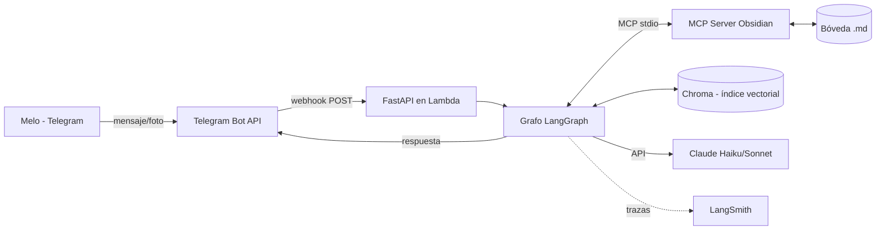
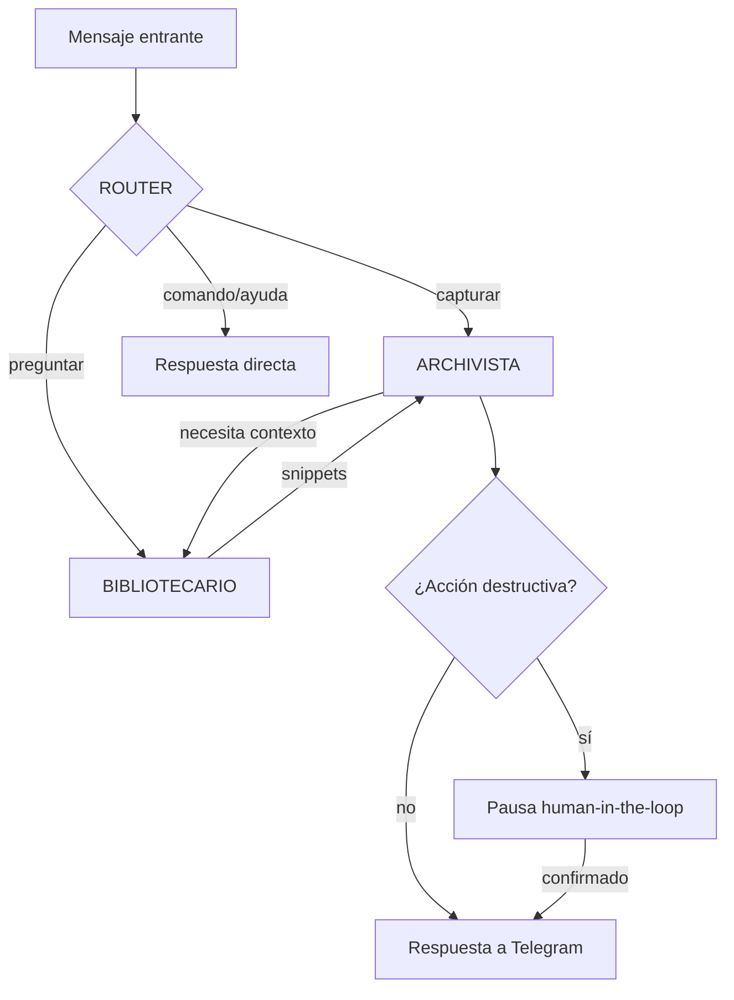

# SEGUNDO CEREBRO — Documento fundacional de diseño y plan de desarrollo

> **Propósito de este documento**: es la fuente de verdad inicial del proyecto. Todas las decisiones acá ya están tomadas (con su justificación). Si algo cambia durante el desarrollo, se actualiza este archivo primero. Está pensado para vivir en la raíz del repo y servir como contexto inicial para cualquier sesión de trabajo (humana o con IA).

> **Estado**: diseño cerrado, desarrollo no iniciado. Fecha: septiembre 2026.

---

## PARTE 1 — DECISIONES CERRADAS (stack definitivo)

| Capa | Decisión | Alternativa descartada | Por qué |
|---|---|---|---|
| Orquestación de agentes | **LangGraph** | AutoGen, n8n, Workato | Es el gap de currícula identificado; framework Python real, no builder visual |
| Modelo de razonamiento | **Claude** — Haiku para ruteo, Sonnet para razonamiento/escritura | Un solo modelo para todo | El router corre en cada mensaje: usar el modelo caro ahí es tirar plata. Ver §4.2 |
| Mensajería | **Telegram Bot API** (webhook) | WhatsApp | Meta cobra mensajes de servicio desde oct-2026; Telegram es gratis y sin plantillas |
| Framework web | **FastAPI** | Handler de Lambda pelado, Flask | Tipado, docs automáticas, testeable, currícula fuerte |
| Deploy inicial | **AWS Lambda + Mangum + API Gateway** | Fargate | Costo ~$0 en reposo. Fargate queda como migración opcional de fase 8 para mostrar Docker |
| Conexión agente↔bóveda | **Servidor MCP propio** (Python SDK oficial) | Código Python a medida dentro del grafo | MCP es el estándar 2026; escribir un server propio es pieza de portfolio |
| Conexión agente↔Telegram | **Directa (webhook + httpx)**, NO vía MCP | MCP server para Telegram | Telegram es la puerta de entrada, no una tool del agente. Meterle MCP es complejidad sin ganancia. El agente responde por el mismo canal que recibió |
| Almacenamiento de notas | **Bóveda Obsidian** (markdown plano) en servidor AWS, headless | Base de datos | Ya decidido en sesiones anteriores; capa visual gratis |
| Búsqueda semántica | **RAG: Chroma embebido + embeddings de Voyage AI** | Pinecone, Weaviate, FAISS | Chroma es librería (costo $0, persiste a disco, API simple). Voyage es el proveedor de embeddings recomendado por Anthropic, tier gratuito generoso. FAISS descartado por no traer persistencia+metadata out of the box |
| Memoria de corto plazo | **Checkpointer de LangGraph sobre SQLite** | Redis | Ya decidido: Redis prescindible. SQLite local del server cumple el rol sin costo. Migrable a Redis/Postgres cambiando una línea |
| Estado compartido | **Estado tipado de LangGraph (pizarra)** con Pydantic | dicts sueltos | Validación y autocompletado; error de esquema explota en desarrollo, no en producción |
| Observabilidad | **LangSmith tier gratuito** (5.000 trazas/mes) | Langfuse self-hosted | Dos líneas de config, cero infra propia. A ~360 llamadas/mes sobra margen |
| CI/CD | **GitHub Actions**: ruff + mypy + pytest + deploy en push a main | Deploy manual | Es el gap de "experiencia de producción" |
| Gestión de dependencias | **uv** + `pyproject.toml` | pip + requirements.txt | Estándar moderno 2026, rápido, lockfile reproducible |
| Python | **3.12** | 3.13 | Compatibilidad garantizada con todo el stack (Lambda runtime incluido) |
| Imágenes | **Sí, desde fase 7**: fotos por Telegram → visión de Claude → nota en la bóveda | Ignorar imágenes | Caso de uso real de un segundo cerebro (pizarras, tickets, apuntes en papel) |

---

## PARTE 2 — ARQUITECTURA DEL SISTEMA

### 2.1 Vista general



Todo (bóveda, Chroma, SQLite del checkpointer) vive en el mismo servidor/volumen AWS. La compu y el celular de Melo solo sincronizan la bóveda cuando se conectan (decisión previa: Obsidian headless / Self-hosted LiveSync).

### 2.2 Los agentes (diseño cerrado: 4 nodos, 3 son "agentes")

Principio de diseño: **la menor cantidad de agentes que cubra los casos de uso**. Cada agente extra es más tokens, más latencia y más superficie de error. Se arranca con estos y no se agregan más hasta que la evaluación (§6) demuestre que hace falta.



**1. ROUTER (nodo con Haiku)**
- Único trabajo: clasificar la intención del mensaje en una de estas clases: `capturar` (guardar algo), `consultar` (preguntar algo a la bóveda), `tarea` (crear/completar un pendiente), `imagen` (llegó foto), `comando` (ayuda, estado, config), `ambiguo`.
- Sin herramientas. Devuelve JSON estructurado (clase + confianza). Si `ambiguo`, repregunta al usuario en vez de adivinar.
- Es el nodo que corre en el 100% de los mensajes → por eso Haiku.

**2. ARCHIVISTA (agente con Sonnet)**
- Escribe en la bóveda: decide título, carpeta destino, tags, y links `[[wikilinks]]` a notas existentes.
- Herramientas (todas vía MCP Obsidian): `crear_nota`, `agregar_a_nota`, `listar_carpeta`, `leer_nota`.
- **NO tiene** herramienta de borrar ni de sobrescribir completo. Regla de la sesión anterior: la restricción es de código, no de prompt.
- Para linkear bien, le pide al Bibliotecario "¿hay notas relacionadas con X?" en vez de leer la bóveda entera (patrón mensajero, decidido antes).

**3. BIBLIOTECARIO (agente con Sonnet, el "mensajero")**
- Responde consultas: busca en Chroma (semántico) y/o lee notas puntuales, y devuelve **solo los fragmentos relevantes**, nunca archivos enteros al estado compartido.
- Herramientas: `buscar_semantico` (Chroma), `leer_nota`, `buscar_por_titulo` (MCP).
- Es de solo lectura por diseño: no tiene ninguna herramienta de escritura.

**4. Nodo de respuesta directa (sin LLM o con Haiku)**
- Comandos fijos (`/ayuda`, `/estado`, `/costos`) se responden con texto plantillado. Cero tokens de Sonnet.

**Agente diferido a fase 9 (no construir antes): DIGESTOR** — resumen periódico (semanal) de lo capturado, detección de notas huérfanas, sugerencia de links. Se difiere porque no responde a mensajes (corre por cron/EventBridge) y no bloquea nada del flujo principal.

### 2.3 Estado compartido (la "pizarra")

Esquema Pydantic único que viaja por el grafo:

```python
class Estado(BaseModel):
    mensajes: list[Mensaje]          # historial del turno (no de toda la vida)
    intencion: Intencion | None      # lo que decidió el Router
    snippets: list[Snippet]          # lo que trajo el Bibliotecario
    acciones_propuestas: list[Accion]# lo que el Archivista quiere hacer
    requiere_confirmacion: bool      # gatillo human-in-the-loop
    presupuesto: Presupuesto         # tokens/pasos consumidos vs. límite
    respuesta_final: str | None
```

### 2.4 Control, seguridad y presupuesto (reglas duras)

1. **Herramientas por agente restringidas en código** (tabla de §2.2). El prompt describe el rol; el código impone el límite.
2. **Human-in-the-loop**: cualquier acción marcada destructiva/riesgosa (hoy: ninguna existe porque el Archivista no puede borrar; queda el mecanismo listo para cuando se sumen acciones nuevas) usa `interrupt()` de LangGraph → el sistema manda a Telegram "¿Confirmás X? (sí/no)" y el grafo queda pausado en el checkpointer hasta la respuesta.
3. **Freno por presupuesto** (idea de la sesión anterior, ahora concreta): cada corrida arranca con límite de **15 pasos de grafo y 50.000 tokens acumulados**. Un nodo contador se ejecuta antes de cada agente; si se superó el límite, el grafo corta y devuelve: qué se logró, qué faltó, y dónde se trabó. Mismo patrón que la pausa por riesgo, gatillado por gasto.
4. **Un solo usuario autorizado**: el webhook valida el `chat_id` de Melo y el secret token de Telegram. Cualquier otro remitente se ignora (ni se loguea el contenido).

### 2.5 La bóveda (estructura inicial)

```
boveda/
  00-inbox/        ← todo lo capturado cae acá primero
  10-notas/        ← notas permanentes (el Archivista promueve desde inbox)
  20-tareas/       ← una nota por lista, checkboxes markdown
  30-imagenes/     ← foto original + nota .md con la descripción/transcripción
  90-sistema/      ← logs legibles, digest semanal (fase 9)
```

Convención de frontmatter en cada nota: `fecha`, `origen: telegram`, `tags`, `estado: inbox|permanente`. El Archivista la respeta siempre; el índice de Chroma la usa como metadata filtrable.

### 2.6 Manejo de imágenes (fase 7)

Flujo: foto llega por Telegram → FastAPI la descarga (API de archivos de Telegram) → se guarda en `30-imagenes/` → el Router la clasifica como `imagen` → el Archivista la manda a Claude con visión (Sonnet) pidiendo: transcripción de texto visible + descripción de una línea + tags sugeridos → crea la nota `.md` acompañante con link a la imagen → la nota entra al índice RAG como cualquier otra (la imagen en sí no se indexa, su descripción sí).

### 2.7 Interfaz

- **Única interfaz de usuario: Telegram.** Sin frontend web propio (decisión: no aporta al objetivo y suma mantenimiento).
- **Capa visual de las notas: Obsidian** en la compu/celular de Melo (sincronizado). Obsidian *es* la UI de lectura rica; el bot es la UI de captura y consulta rápida.
- **Interfaz de operación/debug: LangSmith** (trazas) + `/estado` y `/costos` por Telegram.

---

## PARTE 3 — ESTRUCTURA DEL REPO

```
segundo-cerebro/
  DISEÑO.md                  ← este documento
  pyproject.toml             ← uv, deps, config de ruff/mypy/pytest
  src/
    app/main.py              ← FastAPI: webhook, validación, healthcheck
    grafo/
      estado.py              ← modelos Pydantic (§2.3)
      grafo.py               ← construcción del StateGraph
      nodos/                 ← router.py, archivista.py, bibliotecario.py, directo.py, presupuesto.py
      prompts/               ← un .md por agente (equivalente a "skills", editable sin tocar código)
    mcp_obsidian/servidor.py ← MCP server propio de la bóveda
    rag/indexar.py           ← chunking + embeddings + Chroma (corre como script y como tool)
    telegram/cliente.py      ← enviar mensajes, bajar archivos
  tests/
    unit/                    ← nodos con LLM mockeado, MCP server, parsers
    eval/mensajes.jsonl      ← los 20-30 mensajes etiquetados (§6)
  .github/workflows/ci.yml
  infra/                     ← template SAM o Terraform (fase 6, elegir SAM por simpleza)
```

---

## PARTE 4 — DECISIONES FINAS

### 4.1 Por qué el MCP server va por stdio y no HTTP
El grafo y el server de Obsidian corren en el mismo proceso/máquina. stdio es el transporte estándar para ese caso: sin puertos, sin auth extra, sin red. Si algún día el server se separa a otra máquina, el SDK permite cambiar a Streamable HTTP sin reescribir las tools.

### 4.2 Modelos concretos
- Router y respuestas plantilladas: `claude-haiku-4-5`.
- Archivista, Bibliotecario, visión: `claude-sonnet-4-6` (o el Sonnet vigente al momento de construir — verificar en la doc de Anthropic, no asumir).
- Los nombres de modelo van en config/env, nunca hardcodeados en los nodos.

### 4.3 Embeddings y chunking
- Voyage AI (`voyage-3.5-lite` o el equivalente vigente — verificar al construir), vía API.
- Chunking: por secciones de markdown (headers) con máximo ~500 tokens por chunk; cada chunk guarda `ruta`, `titulo`, `tags` como metadata en Chroma.
- Reindexado: incremental — al escribir una nota, el Archivista dispara la indexación de esa nota sola. Un reindex completo existe como script manual.

### 4.4 Qué NO entra (repetido a propósito, para resistir la tentación)
PyTorch, TensorFlow, AutoGen, n8n, Workato, UiPath, Redis, Pinecone, frontend web propio, fine-tuning. Justificación completa en el plan tecnológico anterior. Regla: nada de esto entra sin que la evaluación (§6) demuestre una necesidad que el stack actual no cubre.

---

## PARTE 5 — PLAN DE DESARROLLO PASO A PASO

Cada fase termina con un **criterio de aceptación verificable**. No se avanza a la siguiente sin cumplirlo. Estimaciones pensadas para ritmo part-time sin experiencia previa en LangGraph ni AWS (dato de la sesión anterior).

**FASE 0 — Fundaciones (1 sesión)**
Repo en GitHub, `uv init`, Python 3.12, ruff+mypy+pytest configurados, este documento en la raíz, CI que corre lint+tests (aunque el test sea `assert True`).
✅ *Push a main → CI verde.*

**FASE 1 — Hola mundo LangGraph (1-2 sesiones)**
Grafo mínimo de 2 nodos con estado Pydantic, corriendo por CLI local, llamando a Claude una vez. LangSmith conectado desde acá (2 env vars).
✅ *`uv run python -m grafo` responde, y la traza aparece en LangSmith.*

**FASE 2 — Router + esqueleto de agentes, todo local por CLI (2-3 sesiones)**
Los 4 nodos de §2.2 con sus prompts en `prompts/`. El Archivista y Bibliotecario todavía usan herramientas *falsas* (escriben en una carpeta local cualquiera). Nodo de presupuesto funcionando (cortar a los N pasos y devolver resumen parcial).
✅ *Por CLI: "guardá que la idea X me gustó" crea un archivo; "¿qué guardé de X?" lo encuentra; un mensaje diseñado para loopear se corta por presupuesto con resumen.*

**FASE 3 — MCP server de Obsidian (2-3 sesiones)**
`mcp_obsidian/servidor.py` con el SDK oficial de Python: tools `crear_nota`, `agregar_a_nota`, `leer_nota`, `listar_carpeta`, `buscar_por_titulo`. Respeta la estructura y el frontmatter de §2.5. Los agentes pasan a usar estas tools reales (vía stdio). Tests del server sin LLM (llamadas MCP directas).
✅ *El flujo de fase 2 ahora escribe/lee una bóveda Obsidian real y las notas se ven bien abiertas en Obsidian.*

**FASE 4 — RAG (2 sesiones)**
`rag/indexar.py`: chunking + Voyage + Chroma persistente. Tool `buscar_semantico` conectada al Bibliotecario. Indexación incremental al escribir.
✅ *Una pregunta cuya respuesta está en una nota vieja con otras palabras ("¿qué dije sobre plata?" encontrando una nota que habla de "presupuesto") se responde bien.*

**FASE 5 — FastAPI + Telegram real, corriendo local (2 sesiones)**
`app/main.py` con el endpoint webhook, validación de secret y chat_id, `telegram/cliente.py`. Túnel local (ngrok o similar) para probar con el bot real desde el celular. Human-in-the-loop por Telegram funcionando (aunque hoy no haya acciones destructivas, se prueba el mecanismo con una acción de mentira).
✅ *Mensaje desde el celular de Melo → respuesta del bot; mensaje desde otro chat_id → silencio.*

**FASE 6 — AWS + CI/CD completo (3-4 sesiones, la fase con más fricción esperada)**
Cuenta AWS con presupuesto/alarma de facturación configurada ANTES que nada. SAM: Lambda (FastAPI+Mangum) + API Gateway. Bóveda+Chroma+SQLite en almacenamiento persistente (EFS montado en Lambda — verificar al construir; si la fricción es alta, adelantar acá la alternativa Fargate+EBS). Webhook de Telegram apuntado a la URL real. GitHub Actions deployando en push a main.
✅ *El bot responde con la compu de Melo apagada, y un push a main llega solo a producción.*

**FASE 7 — Imágenes (1-2 sesiones)**
Flujo completo de §2.6.
✅ *Foto de una pizarra/apunte por Telegram → nota con transcripción en `30-imagenes/`, encontrable después por búsqueda semántica.*

**FASE 8 (opcional, para portfolio) — Migración a Fargate**
Dockerfile + servicio Fargate, mismo código. Solo si se quiere el badge de "Docker + contenedores en AWS".

**FASE 9 — Evaluación + Digestor (2-3 sesiones)**
Armar `eval/mensajes.jsonl` (§6) con mensajes reales acumulados durante las fases 5-7. Script que corre el set contra el Router y mide tasa de acierto; se incorpora al CI como test de regresión (falla si el acierto baja del umbral que fije la primera medición). Después, y solo después, el agente Digestor semanal vía EventBridge.
✅ *Cambiar un prompt y saber en un comando si mejoró o empeoró.*

---

## PARTE 6 — EVALUACIÓN (cómo sabemos que funciona)

- **Set de prueba**: 20-30 mensajes reales, etiquetados a mano con la intención correcta y (para capturas) la carpeta/tags esperados. Formato JSONL. Pendiente de la sesión anterior; se llena con uso real desde la fase 5.
- **Métrica principal**: tasa de acierto del Router (es el nodo del que depende todo lo demás).
- **Métrica secundaria**: para consultas, ¿el Bibliotecario trajo la nota correcta en el top-3?
- **Regla**: ningún cambio de prompt o de modelo se mergea sin correr el set. Nada de fine-tuning hasta tener meses de datos y una tasa de acierto estancada.
- **Corrección del día a día en tareas subjetivas** (tema no cerrado de la sesión anterior): decisión pragmática — comando `/corregir` en Telegram que mueve la última nota a donde corresponde Y agrega ese caso al set de evaluación. La corrección manual alimenta el set; el set corrige los prompts. No se automatiza más que eso por ahora.

---

## PARTE 7 — PRIVACIDAD (los dos tramos identificados, ahora con decisión)

1. **Datos que pasan por el LLM externo**: aceptado como trade-off consciente para un asistente personal. Mitigación: solo se envía al modelo el mensaje del turno + snippets puntuales (patrón mensajero), nunca la bóveda entera.
2. **Dónde vive la bóveda**: en el servidor AWS de Melo (cuenta propia, volumen cifrado en reposo — EFS/EBS lo traen por defecto, verificar que esté activado). Sincronización a dispositivos por el mecanismo elegido en la decisión de headless. No hay terceros adicionales con acceso al contenido.

---

## PRÓXIMA ACCIÓN CONCRETA

Fase 0. Una sesión: crear el repo, poner este documento en la raíz, y dejar el CI en verde. Nada más que eso.
